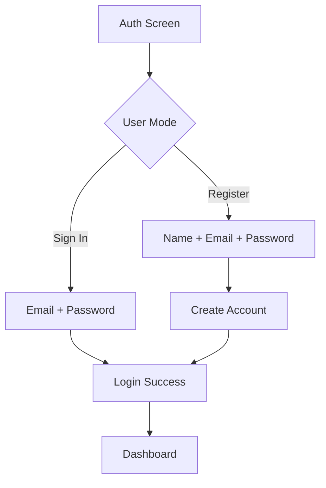
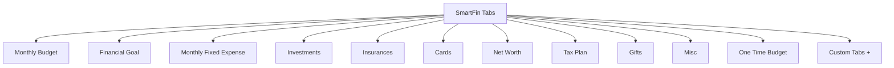
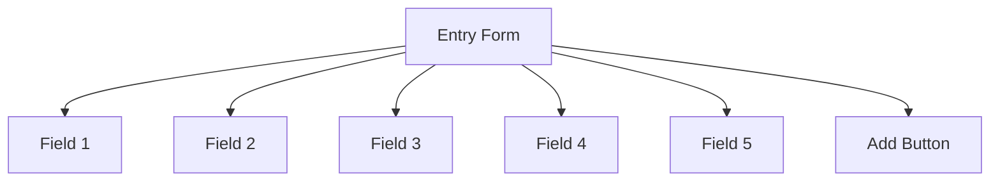
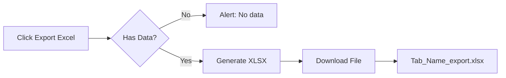
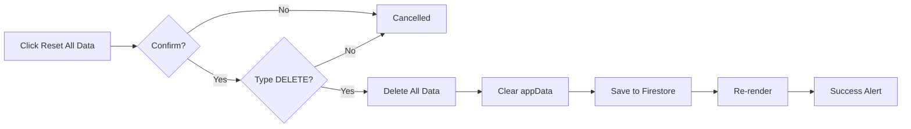
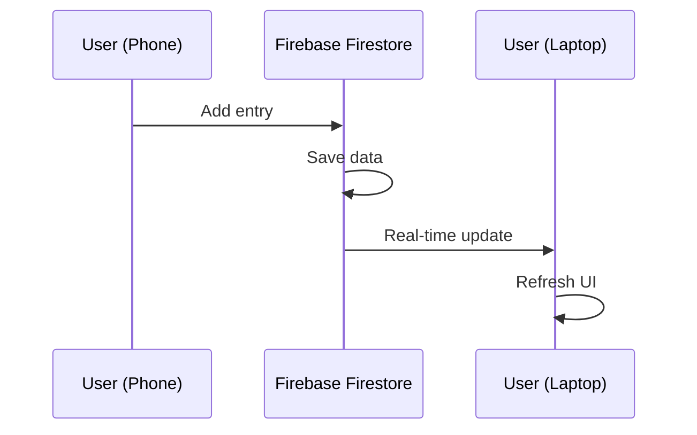

# SmartFin – User Manual

A comprehensive guide to using SmartFin for personal financial planning.

---

## Table of Contents

1. [Overview](#overview)
2. [Getting Started](#getting-started)
3. [Authentication](#authentication)
4. [Dashboard UI](#dashboard-ui)
5. [Tabs & Categories](#tabs--categories)
6. [Adding Entries](#adding-entries)
7. [Managing Entries](#managing-entries)
8. [Search & Filter](#search--filter)
9. [Export to Excel](#export-to-excel)
10. [Reset All Data](#reset-all-data)
11. [Custom Tabs](#custom-tabs)
12. [Cross-Device Sync](#cross-device-sync)
13. [FAQ](#faq)

---

## Overview

SmartFin is a dark-themed personal finance application that helps you track:
- Monthly budgets and expenses with category-based tracking
- Financial goals and savings with progress tracking
- Monthly fixed expenses with graphs and time tracking
- Investments and returns with growth projections
- Insurance policies with nominee management
- Credit/debit cards with credit limit tracking
- Net worth (assets & liabilities) with projection till age 70
- Tax planning under new/old regimes with automatic income integration
- Gifts and charitable giving with category tracking
- Emergency fund requirements with status indicators

All data syncs across devices via Firebase, so you can access your financial data from anywhere.

---

## Getting Started

### Prerequisites

- Modern web browser (Chrome, Firefox, Safari, Edge)
- Firebase project configured (see README.md for setup)
- Internet connection for Firebase sync

### Opening the App

Simply open `index.html` in your browser. No server required.

---

## Authentication

### UI Structure



### Sign In

1. Enter your registered email address
2. Enter your password (minimum 6 characters)
3. Click **Sign In**

### Register (New Account)

1. Click **Register** link below the form
2. Enter your **name** (displayed in header after login)
3. Enter your email address
4. Create a password (minimum 6 characters)
5. Click **Create Account**

### Auth Screen Layout

```
┌─────────────────────────────────┐
│         [₹ Logo]                │
│         SmartFin                 │
│   Smart Financial Planning      │
├─────────────────────────────────┤
│                                 │
│  Your name: [______________]    │
│  Email address: [___________]   │
│  Password:      [**********]   │
│                                 │
│  [ Sign In ]                    │
│                                 │
│  Don't have an account? Register│
└─────────────────────────────────┘
```

---

## Dashboard UI

### Main Dashboard Layout

```mermaid
flowchart LR
    subgraph Header
        A[Logo + Brand]
        B[User Name]
        C[Sign Out]
    end
    
    subgraph Tabs
        D[Monthly Budget]
        E[Financial Goal]
        F[Investments]
        G[...]
        H[+ Add Tab]
    end
    
    subgraph Metrics
        I[Planned]
        J[Actual]
        K[Balance]
        L[Items]
    end
    
    subgraph WorkArea
        M[Entry Form]
        N[Toolbar: Search | Export | Clear]
        O[Data Table]
    end
    
    Header --> Tabs
    Tabs --> Metrics
    Metrics --> WorkArea
```

### Header Section

| Element | Description |
|---------|-------------|
| **₹ Logo** | SmartFin branding with rupee symbol |
| **SmartFin** | Application name |
| **Subtitle** | Current active tab name |
| **User Name** | Your registered name (from registration) |
| **Sign Out** | Logout button |

### Summary Metrics

| Metric | Description |
|--------|-------------|
| **Planned** | Total planned/budgeted amount for current tab |
| **Actual** | Total actual spent/achieved amount |
| **Balance** | Difference (Planned - Actual) |
| **Items** | Total number of entries in current tab |

---

## Tabs & Categories

### Available Tabs



### Tab Details

| Tab ID | Name | Purpose | Key Fields |
|--------|------|---------|------------|
| `monthlyBudget` | Monthly Budget | Recurring monthly income & expenses | Item Name, Planned, Actual, Date, Note |
| `financialGoal` | Financial Goal | Savings targets (emergency fund, down payment) | Goal Name, Target Amount, Current Amount, Target Date |
| `monthlyFixedExpense` | Monthly Fixed Expense | Fixed bills (rent, insurance, utilities) | Expense Name, Monthly Cost, Actual Paid, Due Date |
| `investments` | Investments | Stocks, mutual funds, SIPs | Investment Name, Invested Amount, Current Value, Purchase Date |
| `insurances` | Insurances | Life, health, vehicle policies | Policy Name, Premium, Coverage, Renewal Date |
| `cards` | Cards | Credit/debit card tracking | Card Name, Credit Limit, Outstanding, Due Date |
| `netWorth` | Net Worth | Asset & liability summary | Asset/Liability Name, Value, Type (Asset/Liability), Date |
| `taxPlan` | Tax Plan | Tax-saving investments, deductions | Tax Saving Item, Amount Invested, Tax Saved, Investment Date |
| `gifts` | Gifts | Gifts given/received | Gift Description, Value, Given/Received, Date |
| `misc` | Misc | Miscellaneous items | Item Name, Amount, Actual, Date, Note |
| `oneTimeBudget` | One Time Budget | Special events (wedding, vacation) | Expense Name, Budgeted, Spent, Date, Note |

### Tab Bar UI

```
┌────────────────────────────────────────────────────────────────┐
│ [Monthly Budget] [Financial Goal] [Investments] ... [+]      │
└────────────────────────────────────────────────────────────────┘
```

- **Colored pills** for each tab
- **Active tab** highlighted with shadow
- **Scrollable** horizontally on smaller screens
- **+ button** to add custom tabs

---

## Adding Entries

### Entry Form Layout



### Step-by-Step

1. **Select a tab** from the tab bar
2. **Fill in the form fields** (fields change based on tab)
3. **Click Add** to save the entry

### Example: Adding a Monthly Budget Entry

```
┌─────────────────────────────────────────────────────────────┐
│ Item Name:       [Rent                         ]            │
│ Planned Amount:  [15000                        ]            │
│ Actual Amount:   [15000                        ]            │
│ Date:            [2024-01-01                   ]            │
│ Note:            [Monthly house rent           ]            │
│                                                             │
│ [ Add ]                                                     │
└─────────────────────────────────────────────────────────────┘
```

### Form Field Types

| Type | Description | Example |
|------|-------------|---------|
| **Text** | Free-form text input | "Rent", "HDFC SIP" |
| **Number** | Numeric value (₹) | 15000, 50000 |
| **Date** | Date picker | 2024-01-15 |
| **Select** | Dropdown options | "Asset", "Liability" |

---

## Managing Entries

### Data Table Layout

```
┌─────────────────────────────────────────────────────────────────┐
│ Name        | Planned    | Actual     | Date       | Note        │
├─────────────────────────────────────────────────────────────────┤
│ Rent        | ₹15,000    | ₹15,000    | 2024-01-01 | House rent │
│ Groceries   | ₹8,000     | ₹7,500     | 2024-01-02 | Weekly     │
│ Electricity | ₹3,000     | ₹3,200     | 2024-01-03 |            │
│ ...         | ...        | ...        | ...        | ...        │
└─────────────────────────────────────────────────────────────────┘
```

### Deleting an Entry

1. Locate the entry in the table
2. Click the **Delete** button in the last column
3. Entry is removed immediately (no confirmation)

### Clearing Entire Tab

1. Click **Clear Tab** button in toolbar
2. Confirm the action in the popup dialog
3. All entries in current tab are deleted

---

## Search & Filter

### Search Box

```
┌─────────────────────────────────────────────────────┐
│ 🔍 Search items…                     [Export][Clear]│
└─────────────────────────────────────────────────────┘
```

### How to Search

1. Type in the **Search** box
2. Results filter in real-time
3. Searches across **all fields** (name, date, note, etc.)

### Example

- Search: "rent" → Shows entries containing "rent" in any field
- Search: "2024-01" → Shows entries from January 2024
- Search: "HDFC" → Shows HDFC-related entries

---

## Export to Excel

### Export Button

```
┌─────────────────────────────────────────────────────┐
│ 🔍 Search items…           [Export][Clear][Reset]   │
└─────────────────────────────────────────────────────┘
```

### Export Flow



### Export Features

- **Format**: `.xlsx` (Excel)
- **Filename**: `{Tab_Name}_export.xlsx`
- **Content**: All entries from current tab with headers
- **Columns**: Same as table headers for the tab

### Example Export

For "Monthly Budget" tab, the Excel file contains:

| Item Name | Planned Amount | Actual Amount | Date | Note |
|-----------|----------------|---------------|------|------|
| Rent | 15000 | 15000 | 2024-01-01 | House rent |
| Groceries | 8000 | 7500 | 2024-01-02 | Weekly |

---

## Reset All Data

### Reset Button

The "Reset All Data" button allows you to permanently delete all your financial data.

### Reset Flow



### What Gets Deleted

When you reset all data, the following is permanently deleted:

- All budget entries
- All monthly budget data
- All financial goals
- All investments
- All insurances
- All cards
- Net worth data
- Tax plan data
- Gifts
- Emergency fund data

### Confirmation Required

For your protection, the reset requires double confirmation:

1. **First confirmation**: A dialog warning you about what will be deleted
2. **Second confirmation**: You must type "DELETE" to confirm

### ⚠️ Important

**This action cannot be undone.** Use with caution.

---

## Custom Tabs

### Adding a Custom Tab

1. Click the **+** button in the tab bar
2. Enter a name for your custom tab (e.g., "Wedding Expenses")
3. Click OK

### Custom Tab Features

- **Same fields** as "Misc" tab
- **Dark gray color** by default
- **Saved to Firestore** with your data
- **Syncs across devices**

### Example Use Cases

- Wedding expenses
- Vacation budget
- Home renovation
- Education fund
- Emergency fund tracking

---

## Cross-Device Sync

### How Sync Works



### Sync Features

- **Real-time sync** via Firebase Firestore
- **Works across all devices** (phone, tablet, laptop)
- **Automatic** - no manual sync required
- **Same data everywhere** - consistent view

### Requirements for Sync

- Firebase project configured
- Internet connection
- Same user account signed in on all devices

### Data Storage

- **Location**: Firebase Firestore → `users/{uid}/tabData`
- **Structure**: 
  ```json
  {
    "tabData": {
      "monthlyBudget": [...entries],
      "investments": [...entries]
    },
    "customTabs": [...],
    "userName": "Your Name"
  }
  ```

---

## FAQ

### Q: Is my data secure?
**A:** Yes. Data is stored in Firebase Firestore with authentication. Only you can access your data.

### Q: Can I use this offline?
**A:** The app requires an internet connection for Firebase sync. Offline mode is not currently supported.

### Q: What happens if I delete my browser data?
**A:** Your data is stored in Firebase, not in your browser. Clearing browser data won't delete your financial data.

### Q: Can I export all tabs at once?
**A:** Currently, you can export one tab at a time. Click the tab you want, then click Export Excel.

### Q: How do I change my password?
**A:** Use Firebase Console to reset your password, or re-register with a new account.

### Q: Can I edit an existing entry?
**A:** Currently, you can delete and re-add entries. Edit functionality can be added in future updates.

### Q: What currency does the app use?
**A:** Indian Rupee (₹). All amounts are formatted with Indian number formatting (e.g., ₹12,34,567).

### Q: Is there a mobile app?
**A:** This is a web application that works on mobile browsers. A native app is not currently available.

### Q: How do I delete my account?
**A:** Delete your user from Firebase Console, or contact support for account deletion assistance.

### Q: Can I share my data with others?
**A:** Currently, data is private to your account. Sharing features can be added in future updates.

---

## Keyboard Shortcuts

| Action | Shortcut |
|--------|----------|
| Focus search box | `/` (not implemented yet) |
| Submit form | `Enter` in form |
| Clear tab | Click button |

---

## Tips & Best Practices

1. **Use consistent naming** for entries (e.g., "Rent" instead of "House Rent Jan")
2. **Update actual amounts regularly** to track your progress
3. **Use the Notes field** for additional context
4. **Export monthly** to keep offline backups
5. **Use custom tabs** for special projects (wedding, vacation)
6. **Check Balance metric** to see if you're over/under budget
7. **Use Date field** to track payment due dates

---

## Troubleshooting

### Issue: Data not syncing
- **Check internet connection**
- **Verify Firebase config is correct**
- **Sign out and sign back in**

### Issue: Export not working
- **Ensure SheetJS library loaded** (check browser console)
- **Verify you have data in the tab**
- **Try a different browser**

### Issue: Can't sign in
- **Verify email and password are correct**
- **Check if account was created**
- **Check Firebase Auth is enabled**

### Issue: Tabs not showing
- **Refresh the page**
- **Check browser console for errors**
- **Verify app.js loaded correctly**

---

## Support

For issues or questions:
- Check the README.md for Firebase setup
- Review this user manual
- Check browser console for error messages

---

## Version History

| Version | Date | Changes |
|---------|------|---------|
| 2.0 | 2026-05-28 | Added Net Worth, Tax Plan, Gifts, Emergency Fund tabs. Removed Misc and One-Time Budget tabs. Added Reset All Data feature with double confirmation. Updated all tabs with Preview/Edit modes and summary calculations. Added graphs and charts for Monthly Fixed Expense, Investments, and Net Worth. |
| 1.0 | 2026-05-28 | Initial release with authentication, 11 tabs, Excel export |

---

*SmartFin – Smart Financial Planning*
*Built with Firebase Firestore for cross-device sync*
