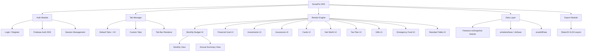
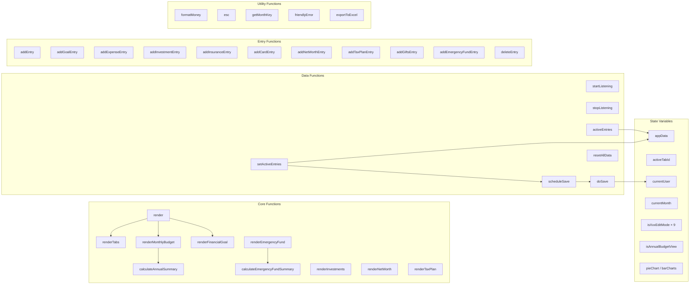
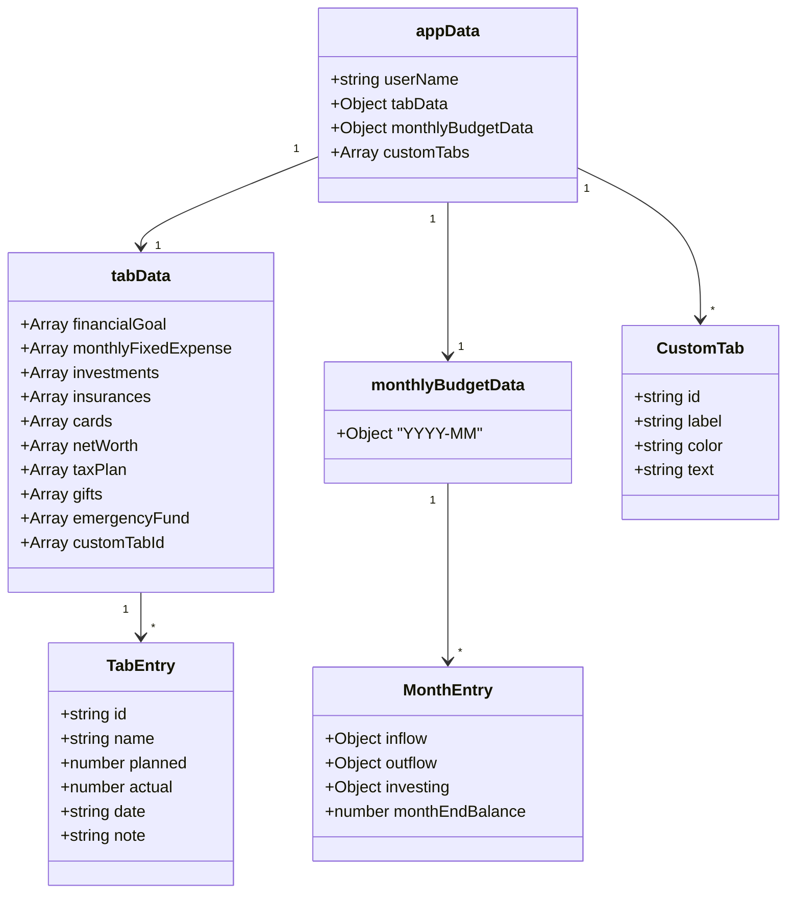
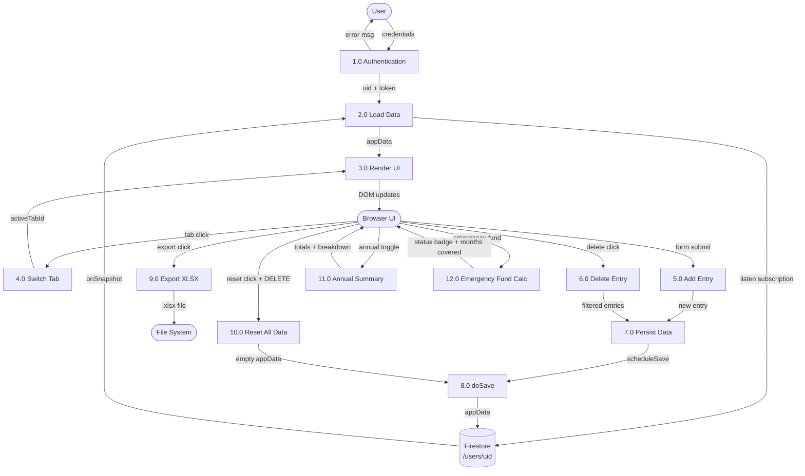
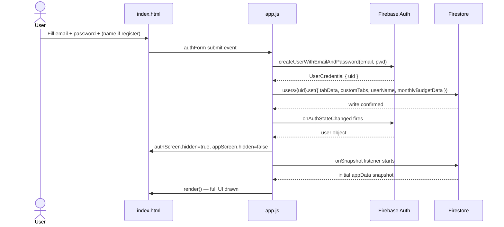
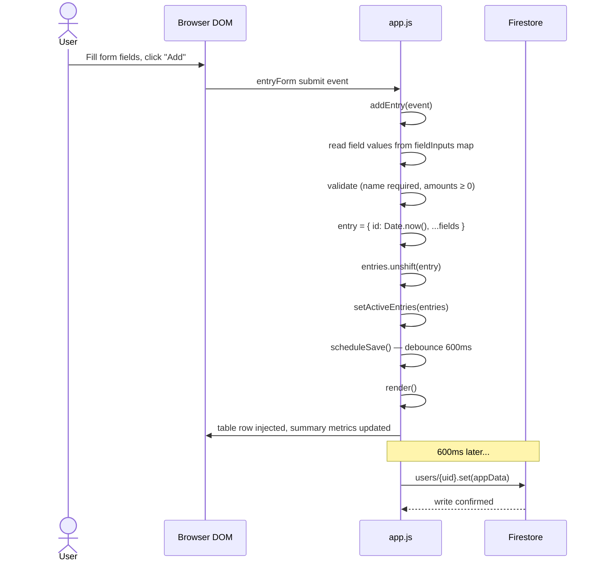
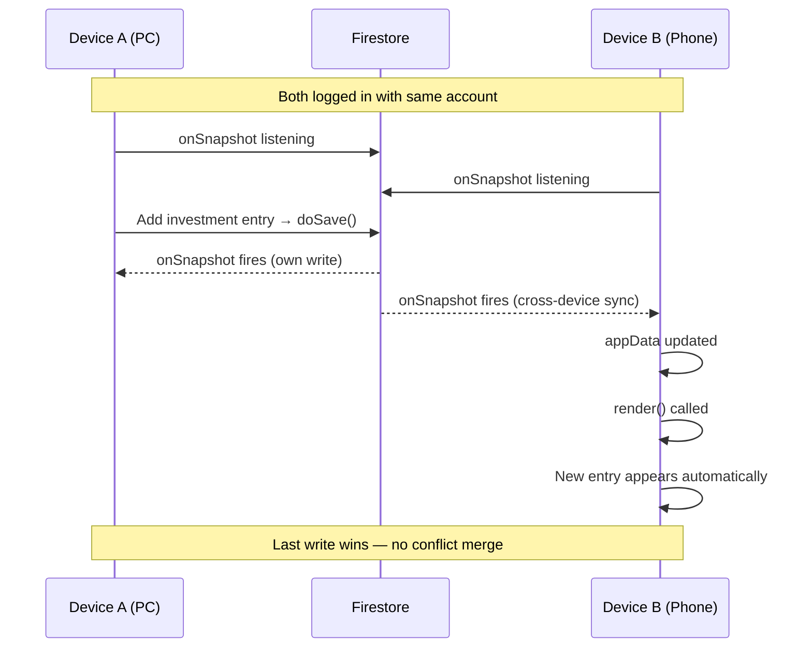
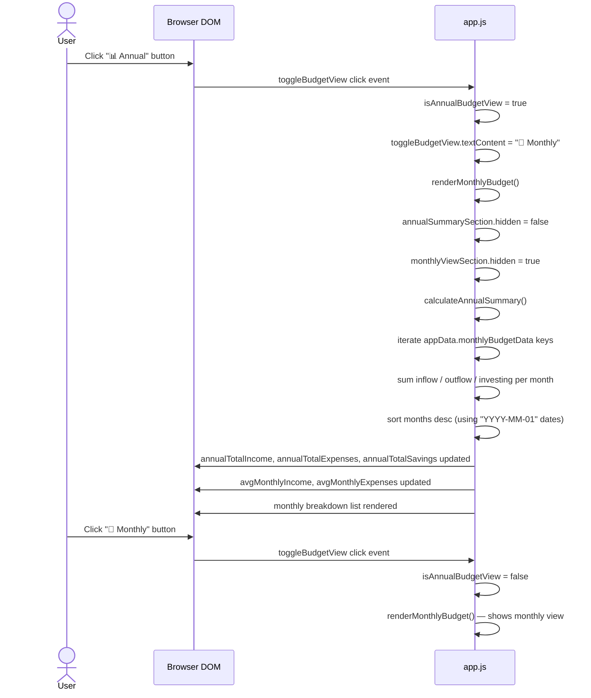
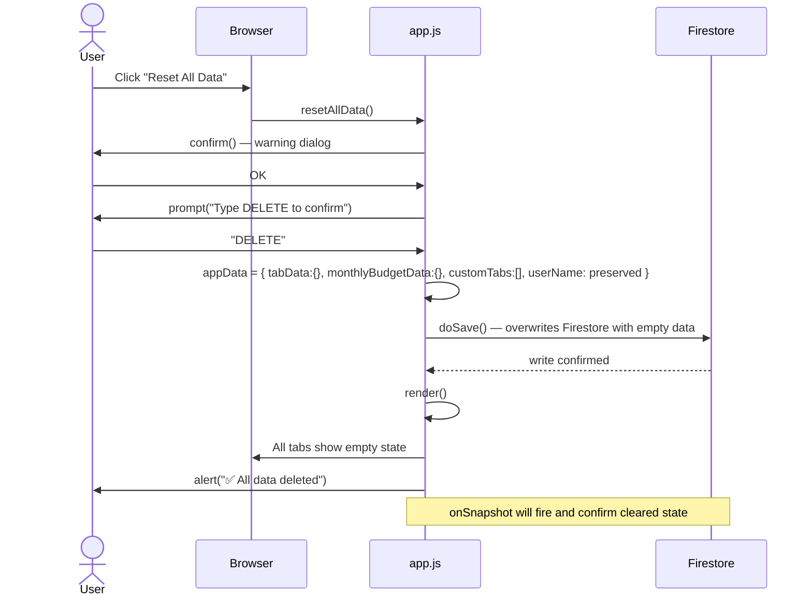
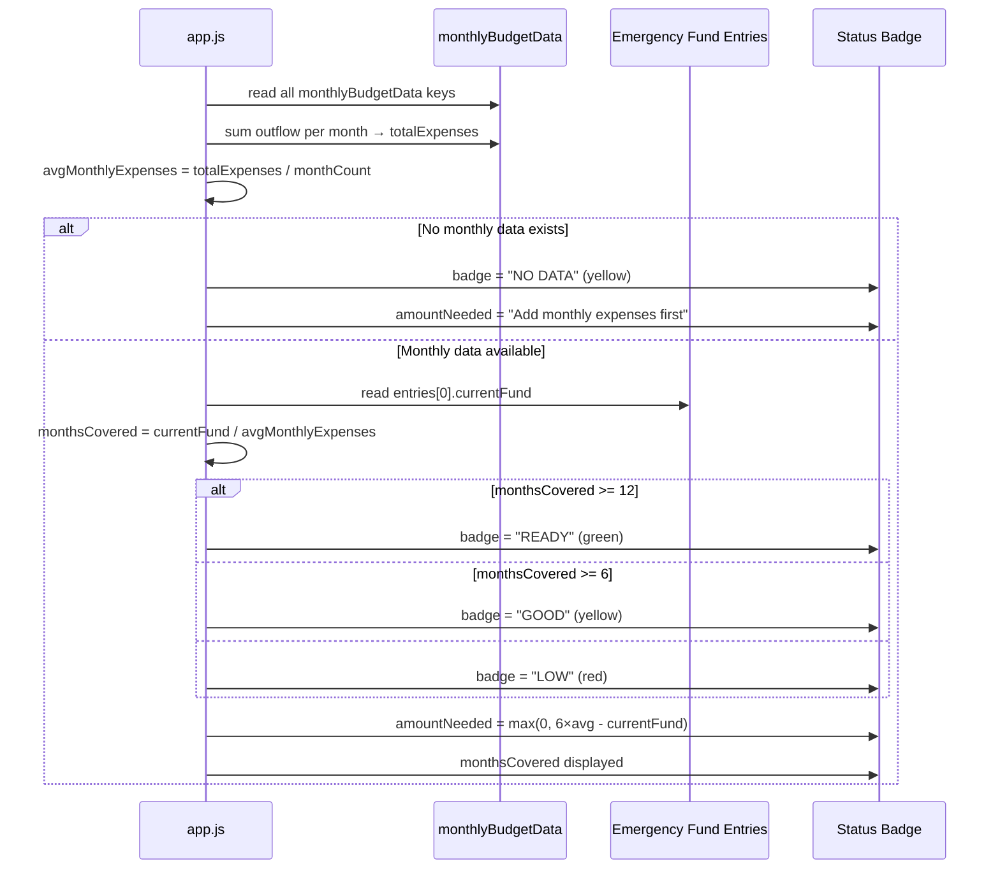

# SmartFin – Architecture Document

> Version 2.0 | May 2026

---

## Table of Contents

1. [Tech Stack](#1-tech-stack)
2. [High-Level Design (HLD)](#2-high-level-design-hld)
3. [Low-Level Design (LLD)](#3-low-level-design-lld)
4. [Data Flow Diagrams (DFD)](#4-data-flow-diagrams-dfd)
5. [Sequence Diagrams](#5-sequence-diagrams)
6. [Data Schema](#6-data-schema)
7. [Final Review Findings](#7-final-review-findings)

---

## 1. Tech Stack

| Layer | Technology | Purpose |
|-------|-----------|---------|
| Markup | HTML5 | Single-page app shell, all UI panels |
| Styling | CSS3 + CSS Variables | Dark theme, responsive grid layouts |
| Logic | Vanilla JavaScript (ES2022, strict mode) | All app logic, rendering, calculations |
| Auth | Firebase Authentication (Email/Password) | User login, registration, session |
| Database | Firebase Firestore (NoSQL) | Real-time data sync across devices |
| Charts | Chart.js 4.4 (CDN) | Pie chart, bar charts, net worth projection |
| Export | SheetJS / XLSX 0.20 (CDN) | Export data to `.xlsx` Excel files |
| Hosting | GitHub Pages (static) | Zero-server deployment |
| Fonts | Google Fonts — Inter | UI typography |

---

## 2. High-Level Design (HLD)

### 2.1 Architecture Overview

```
┌──────────────────────────────────────────────────────────────┐
│                        CLIENT (Browser)                      │
│                                                              │
│  ┌──────────────┐   ┌──────────────────────────────────────┐ │
│  │  index.html  │   │           assets/js/app.js           │ │
│  │  (UI Shell)  │◄──│  Auth │ Render │ CRUD │ Sync │ Export│ │
│  └──────────────┘   └──────────────────────────────────────┘ │
│         │                          │                         │
│  ┌──────────────┐   ┌──────────────────────────────────────┐ │
│  │styles.css    │   │     firebase-config.js               │ │
│  │(Responsive   │   │     (Firebase init + credentials)    │ │
│  │ Layout)      │   └──────────────────────────────────────┘ │
│  └──────────────┘                  │                         │
└───────────────────────────────────┼──────────────────────────┘
                                    │ HTTPS
                    ┌───────────────┼───────────────┐
                    │         Firebase Cloud         │
                    │                               │
                    │  ┌─────────────────────────┐  │
                    │  │  Firebase Auth           │  │
                    │  │  (Email/Password)        │  │
                    │  └─────────────────────────┘  │
                    │                               │
                    │  ┌─────────────────────────┐  │
                    │  │  Cloud Firestore         │  │
                    │  │  /users/{uid}            │  │
                    │  │  • tabData               │  │
                    │  │  • monthlyBudgetData     │  │
                    │  │  • customTabs            │  │
                    │  │  • userName              │  │
                    │  └─────────────────────────┘  │
                    └───────────────────────────────┘
```

### 2.2 Component Map



### 2.3 Deployment View

```
┌─────────────────────────────────────────────────────┐
│               GitHub Pages (Static Hosting)          │
│                                                     │
│   index.html ──────────────────────── /             │
│   assets/css/styles.css ──────── /assets/css/       │
│   assets/js/app.js ───────────── /assets/js/        │
│   assets/js/firebase-config.js ──/assets/js/        │
│   architecture.md                                   │
│   README.md                                         │
│   USER_MANUAL.md                                    │
│   test.html                                         │
└────────────────────┬────────────────────────────────┘
                     │ CDN dependencies (runtime)
          ┌──────────┼──────────┐
          ▼          ▼          ▼
     gstatic.com  jsdelivr.net  sheetjs.com
     (Firebase)   (Chart.js)    (XLSX)
```

---

## 3. Low-Level Design (LLD)

### 3.1 Module Breakdown



### 3.2 appData Schema



### 3.3 Render Decision Tree

```
render()
    │
    ├─ activeTabId === "monthlyBudget"
    │       └─ renderMonthlyBudget()
    │               ├─ isAnnualBudgetView? → calculateAnnualSummary()
    │               └─ else
    │                   ├─ isBudgetEditMode? → renderCategoryFields()
    │                   └─ else → renderCategoryPreview() + renderPieChart()
    │
    ├─ activeTabId === "financialGoal"
    │       └─ renderFinancialGoal()
    │               ├─ isGoalEditMode? → renderGoalDynamicFields() + renderGoalTable()
    │               └─ else → renderGoalPreviewCards()
    │
    ├─ activeTabId === "investments"
    │       └─ renderInvestments()
    │               └─ renderInvestmentChart() + renderInvestmentPreviewCards()
    │
    ├─ activeTabId === "netWorth"
    │       └─ renderNetWorth()
    │               └─ renderNetWorthProjectionChart()
    │
    ├─ activeTabId === "taxPlan"
    │       └─ renderTaxPlan()
    │               └─ renderTaxBreakdown() [new + old regime calc]
    │
    ├─ activeTabId === "emergencyFund"
    │       └─ renderEmergencyFund()
    │               └─ calculateEmergencyFundSummary() [status: LOW/GOOD/READY/NO DATA]
    │
    └─ else (standard tab / custom tab)
            └─ renderDynamicFields() + renderRows() + renderSummary()
```

### 3.4 Save Pipeline

```
User Action (input change / form submit)
        │
        ▼
setActiveEntries(entries)
   or direct appData mutation
        │
        ▼
scheduleSave()           ◄─── debounce 600ms
        │
        ▼
doSave()
        │
        ▼
db.collection("users").doc(uid).set(appData)
        │
        ▼
Firestore Cloud (persisted)
        │
        ▼ (onSnapshot fires on ALL devices logged in with same account)
startListening() → appData updated → render()
```

---

## 4. Data Flow Diagrams (DFD)

### 4.1 Level 0 – Context Diagram

```
                    ┌─────────────────────────────────┐
                    │                                 │
  ─── Login ───────►│                                 │──── Auth Token ────►
                    │                                 │
  ─── Add Data ────►│         SmartFin App            │──── Saved Data ────►
                    │                                 │
  ─── Edit/Delete ─►│                                 │◄─── Real-time Sync ─
                    │                                 │
  ◄─ Reports/Charts─│                                 │──── Export .xlsx ──►
                    │                                 │
  ─── Reset Data ──►│                                 │
                    └─────────────────────────────────┘
         User                                              Firebase Cloud
```

### 4.2 Level 1 – Process Decomposition



### 4.3 Monthly Budget Data Flow

```
User types value in category field
        │
        ▼
handleCategoryFieldChange(event)
        │
        ├── reads: e.target.dataset.fieldId (e.g. "rent")
        ├── reads: e.target.parentElement.parentElement.id (e.g. "outflowFields")
        │
        ▼
appData.monthlyBudgetData[YYYY-MM][category][fieldId] = value
        │
        ├── updates: inflowTotalEdit / outflowTotalEdit / investingTotalEdit (live)
        ├── calls:   calculateAndDisplaySummary(monthData)
        ├── calls:   renderPieChart(monthData)
        └── calls:   scheduleSave()
```

---

## 5. Sequence Diagrams

### 5.1 User Login / Registration



### 5.2 Adding an Entry (Standard Tab)



### 5.3 Real-Time Sync Across Two Devices



### 5.4 Monthly Budget – Annual View Toggle



### 5.5 Reset All Data



### 5.6 Emergency Fund Status Calculation



---

## 6. Data Schema

### 6.1 Firestore Document — `/users/{uid}`

```json
{
  "userName": "Mrunal Muduli",
  "tabData": {
    "financialGoal": [
      { "id": "1748374923001", "name": "Car", "amountNeeded": 800000,
        "amountAccumulated": 200000, "targetDate": "2027-06-01",
        "goalType": "Mid Term", "status": "Ongoing", "details": "" }
    ],
    "investments": [
      { "id": "1748374923002", "name": "HDFC SIP", "initialInvestment": 5000,
        "totalAmount": 65000, "frequency": "Monthly",
        "startDate": "2024-01-01", "maturityDate": "2030-01-01", "details": "" }
    ],
    "emergencyFund": [
      { "id": "1748374923003", "currentFund": 150000, "details": "FD + Savings" }
    ]
  },
  "monthlyBudgetData": {
    "2026-05": {
      "inflow":    { "primaryIncome": 80000, "secondaryIncome": 5000 },
      "outflow":   { "rent": 20000, "loanEMI": 15000, "utilityBills": 3000 },
      "investing": { "sipInvestment": 10000, "monthlySaving": 5000 },
      "monthEndBalance": 32000
    },
    "2026-04": { "inflow": {}, "outflow": {}, "investing": {}, "monthEndBalance": 0 }
  },
  "customTabs": [
    { "id": "my-wedding-2026-1748374923004", "label": "My Wedding 2026",
      "color": "#333", "text": "#fff" }
  ]
}
```

### 6.2 Tax Calculation Logic (Indian Income Tax)

```
New Regime (FY 2024-25):
  Standard Deduction: ₹75,000
  Taxable Income = Gross Income − 75,000

  Slabs:
  ₹0      – ₹3,00,000  →  0%
  ₹3L     – ₹7,00,000  →  5%
  ₹7L     – ₹10,00,000 → 10%
  ₹10L    – ₹12,00,000 → 15%
  ₹12L    – ₹15,00,000 → 20%
  Above ₹15,00,000     → 30%
  + 4% Health & Education Cess on total tax

Old Regime:
  Standard Deduction: ₹50,000
  Deductions: 80C + 80D + 80CCD(1B) + 80CCD(2) + 80E + 80EEA + 80G
  Taxable Income = Gross − 50,000 − Deductions

  Slabs:
  ₹0   – ₹2,50,000 →  0%
  ₹2.5L – ₹5,00,000 →  5%
  ₹5L  – ₹10,00,000 → 20%
  Above ₹10,00,000  → 30%
  + 4% Cess
```

### 6.3 Emergency Fund Thresholds

```
monthsCovered = currentFund ÷ avgMonthlyOutflow

< 6 months  → LOW  (red)    — Urgent: build emergency fund
6–12 months → GOOD (yellow) — Safe but not optimal
≥ 12 months → READY (green) — Fully covered
No outflow data → NO DATA (yellow) — Add monthly budget data first
```

---

## 7. Final Review Findings

### 7.1 Bugs Fixed (all resolved)

| # | Severity | Description | Status |
|---|----------|-------------|--------|
| 1 | Critical | `resetAllData()` called undefined `saveData()` instead of `doSave()` | ✅ Fixed |
| 2 | Critical | `monthlyViewSection` `<div>` unclosed in `index.html` → malformed DOM | ✅ Fixed |
| 3 | High | Annual summary month sort used `new Date("2026-01")` → UTC timezone bug | ✅ Fixed |
| 4 | High | `resetAllData` cleared `userName` from Firestore | ✅ Fixed |
| 5 | High | `addEntry()` called `input.value` without null guard → potential TypeError | ✅ Fixed |
| 6 | Medium | Emergency fund showed "LOW" when no monthly expense data | ✅ Fixed |
| 7 | Medium | `currentEmergencyFundInput` listener had stale `isEditMode` guard | ✅ Fixed |
| 8 | High | `test.html` tested stale 11-tab config with removed tabs | ✅ Rewritten |
| 9 | High | `</script>` literal inside `<script>` block caused parse error | ✅ Fixed |

### 7.2 Architecture Strengths

- **Zero backend** — pure static + Firebase; no server to maintain
- **Real-time sync** — `onSnapshot` propagates changes to all logged-in devices within ~1s
- **Offline tolerant writes** — Firebase SDK queues writes when offline and flushes on reconnect
- **Debounced saves** — 600ms debounce prevents Firestore write spam on rapid typing
- **Safe defaults everywhere** — `|| {}`, `|| []`, `|| 0` guards prevent null reference crashes
- **XSS protected** — all user-content rendered through `esc()` before `innerHTML`
- **Error wrapped** — `formatMoney`, `activeEntries`, `setActiveEntries` all have `try/catch`

### 7.3 Known Limitations

| Limitation | Impact | Recommendation |
|------------|--------|---------------|
| Last-write-wins on simultaneous edits | Low (single-user app) | Use Firestore `merge: true` if multi-user ever needed |
| No offline read caching set up explicitly | Low (Firebase SDK handles it) | Enable Firestore offline persistence for full offline mode |
| No input validation beyond `required` | Medium | Add amount range checks (e.g., no negative investments) |
| No edit-in-place for table rows | UX only | Delete + re-add is current workaround |
| Custom tab data not exported | Low | Extend `exportToExcel` to export all tabs |
| No PWA `manifest.json` | Low | Add manifest for "Add to Home Screen" icon support |

### 7.4 GitHub Pages Checklist

- [x] No server-side code — pure static files
- [x] All dependencies via CDN (Firebase, Chart.js, SheetJS)
- [x] `viewport-fit=cover` + safe-area insets for mobile
- [x] `apple-mobile-web-app-capable` meta for iOS home screen
- [ ] **Action required:** Add `<yourusername>.github.io` to Firebase Console → Authentication → Authorized Domains
- [ ] **Action required:** Replace `YOUR_API_KEY` etc. in `firebase-config.js` with real values before deploying

### 7.5 File Structure

```
smart-financial-planning/
├── index.html              # Single-page app shell (760 lines)
├── assets/
│   ├── css/
│   │   └── styles.css      # All styles + 4 responsive breakpoints (~2050 lines)
│   └── js/
│       ├── app.js          # All application logic (~3250 lines)
│       └── firebase-config.js  # Firebase credentials (replace before deploy)
├── test.html               # Unit test runner (42 automated tests)
├── architecture.md         # This document
├── README.md               # Project overview + setup guide
└── USER_MANUAL.md          # End-user guide (~570 lines)
```
